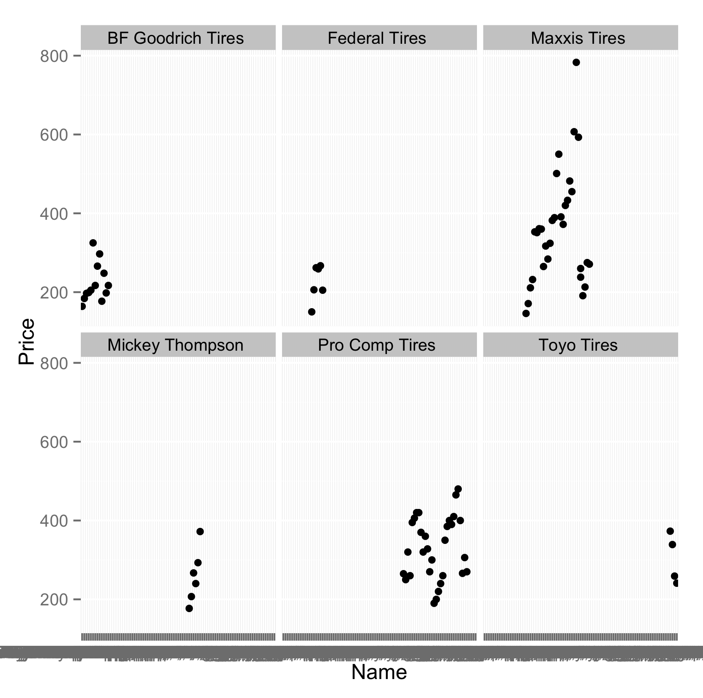
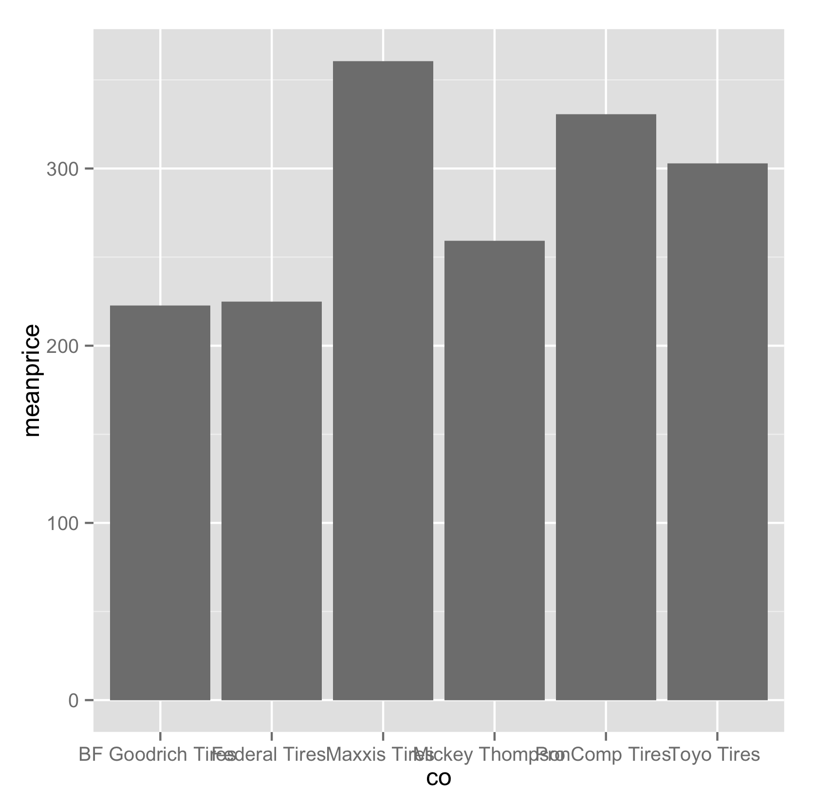
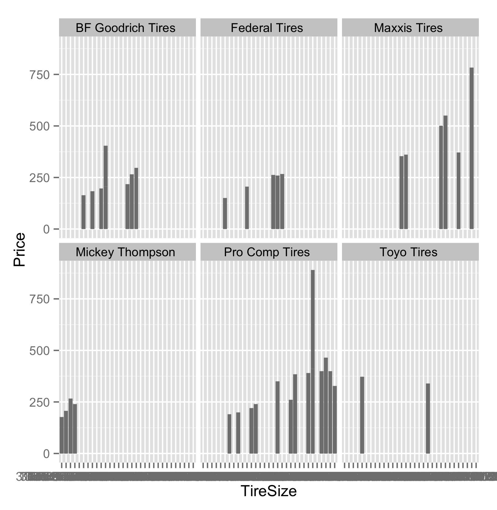

## CarParts
In Undergrad, A classmate wanted to know which tires were the most expensive and which tires were the largest, so I wrote a simple webscraper to get size and price information from the website

## Tire Price

The sorted by string name, was looking at the price of the tires

In addition we looked at tire the average tire price by distributor

## Tire Price by size

First is that we wanted to see just the prices, but we change that the values are parsed out 